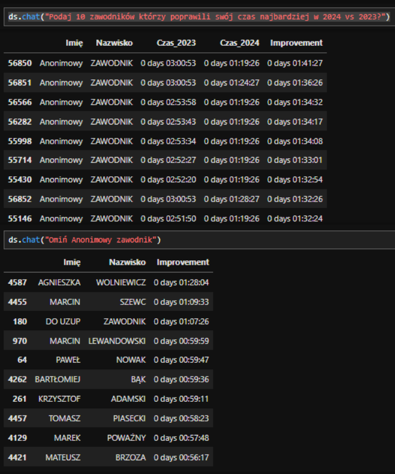

# Porównanie Półmaratonu: Edycje 2023 vs 2024

Zapraszamy do zapoznania się z fascynującą analizą dwóch ostatnich edycji półmaratonu, które odbyły się w latach 2023 i 2024. Projekt skupia się na porównaniu kluczowych aspektów obu wydarzeń, takich jak liczba uczestników, tempo biegu oraz wyniki sportowe. Dzięki szczegółowym danym i analizom, odkryjemy, jakie zmiany zaszły w organizacji i przebiegu tych biegów, a także jakie wnioski można wyciągnąć na przyszłość. Przygotuj się na podróż przez świat biegów długodystansowych, pełną ciekawostek i inspirujących historii.

**Autor**: [Tomasz Waniek](/od-zera-do-ai-portfolio/uczestnicy/tomasz_waniek)

