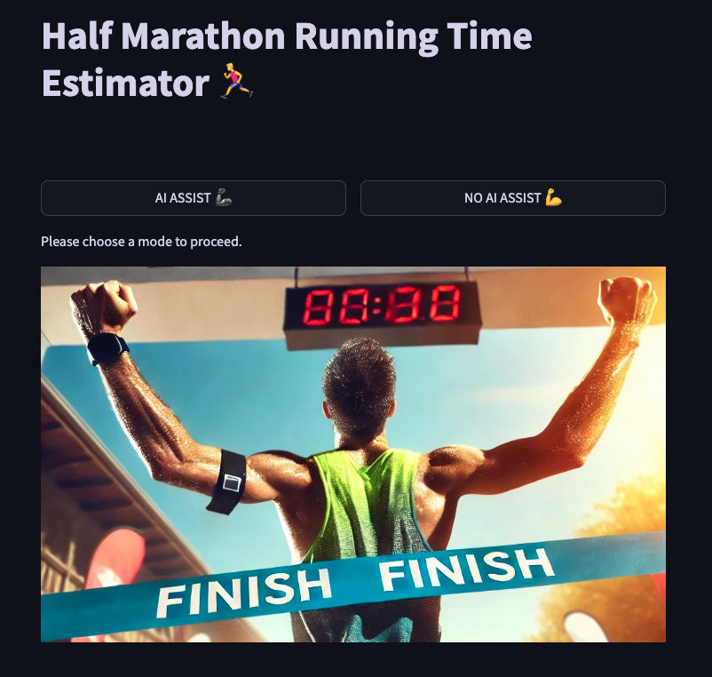
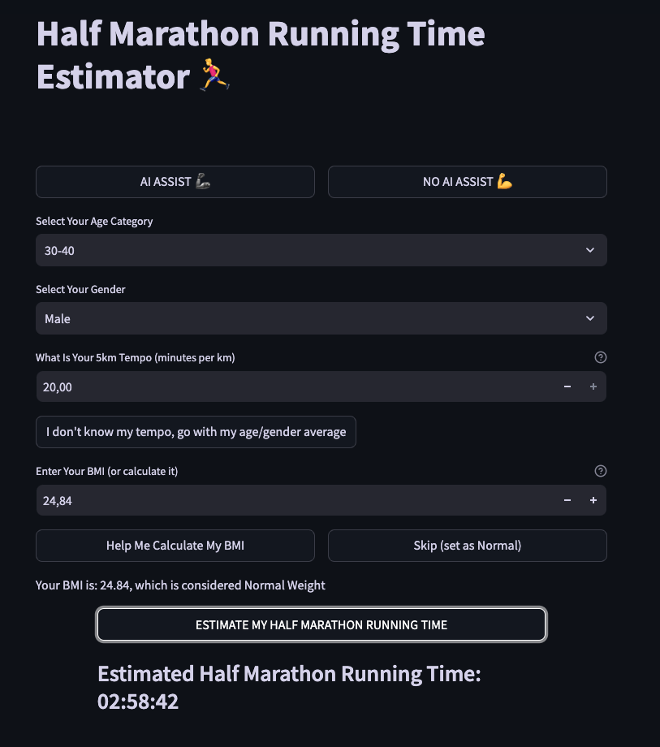

# Aplikacja oblicza szacowany czas przebiegnięcia półmaratonu uwzględniając płeć, wiek, średnie tempo km/m oraz BMI.

**Autor**: [Mateusz Nowakowski](/od-zera-do-ai-portfolio/uczestnicy/mateusz_nowakowski)

Nasza aplikacja do przewidywania czasu przebiegnięcia półmaratonu to zaawansowane narzędzie, które korzysta z modelu uczenia maszynowego pobieranego z chmury. Użytkownicy mogą wybrać jeden z dwóch trybów działania: klasyczny lub AI. W trybie klasycznym dane wprowadzane są ręcznie, natomiast w trybie AI dane są automatycznie pozyskiwane podczas rozmowy z czatem. Oba tryby działają niezależnie, ale korzystają z tego samego modelu, co gwarantuje spójność wyników.

Po zebraniu wszystkich niezbędnych informacji, aplikacja tworzy odpowiedni zestaw danych wejściowych, który jest następnie przetwarzany przez model, aby oszacować czas potrzebny na przebiegnięcie półmaratonu. Dodatkowo, aplikacja uwzględnia wskaźnik BMI, który może wpływać na przewidywany czas. Jeśli użytkownik nie zna swojego BMI, aplikacja obliczy go na podstawie wagi i wzrostu. W przypadku braku danych dotyczących tempa, aplikacja użyje mediany tempa dla danej płci i wieku, bazując na danych z maratonu. W trybie AI użytkownik otrzymuje wsparcie czatu, ale musi podać tempo przynajmniej na 1 km.

Aplikacja jest monitorowana przez system Langfuse i zapisuje wszystkie rozmowy oraz dane wejściowe do chmury, co pozwala na dalszą analizę i doskonalenie modelu.

- [Link do repozytorium](https://github.com/MateuszNowakowski2024/running_estimator)
- [Link do aplikacji](https://runest-app-yua3l.ondigitalocean.app/)

