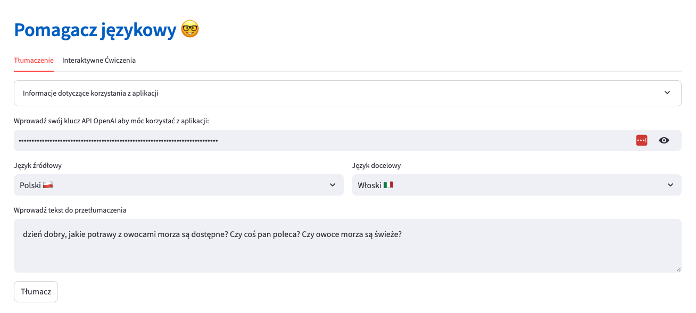
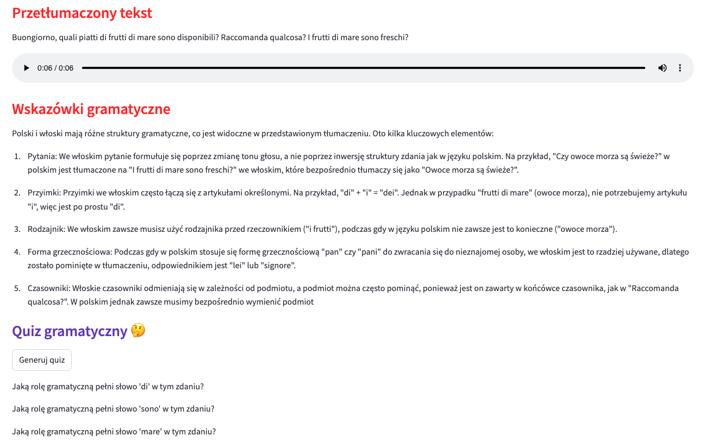
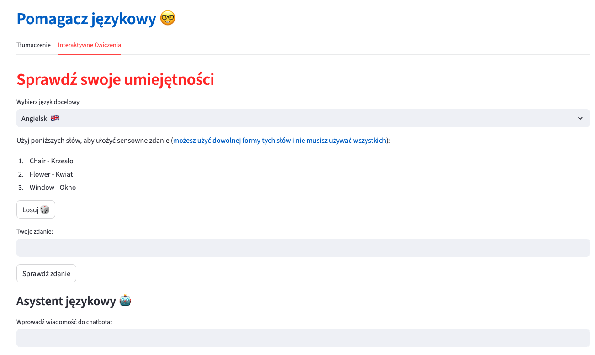

# Kompletne narzędzie do nauki języków obcych

Projekt stworzony przez Kacpra Szarugę.
Pomagacz językowy to kompletne narzędzie do nauki języków obcych, które oferuje wiele możliwości pracy z różnymi językami oraz sprawdzenia swojej wiedzy. Aplikacja nie tylko pozwala tłumaczyć słowa, frazy i pełne zdania, ale także generuje informacje, które pomagają zrozumieć szczegóły gramatyczne. Dzięki Pomagaczowi językowemu nauka języków staje się bardziej efektywna i przyjemna!

Aplikację można znaleźć pod tym [linkiem](https://pomagaczjezykowy.streamlit.app/) a repozytorium pod [tym](https://github.com/Kacper-77/Pomagacz_jezykowy)

Aplikacja posiada bardzo estetyczny i czytelny design.

