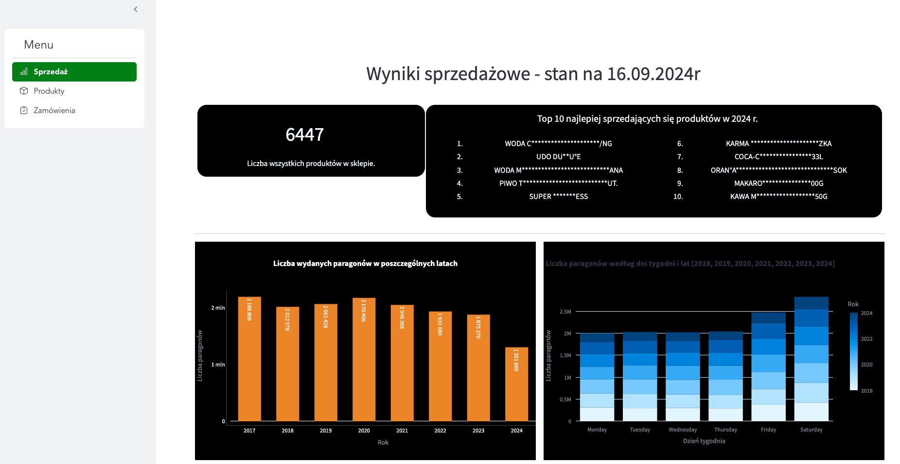
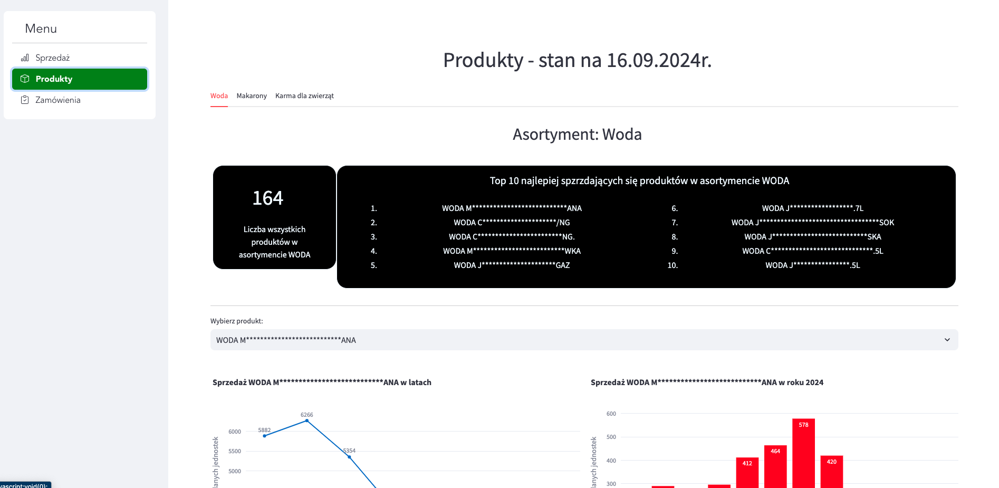

# Pomocnik dla sklepu spożywczego

**Autor**: [Grzegorz Czopiński](/od-zera-do-ai-portfolio/uczestnicy/grzegorz_czopinski)

Grzegorz podjął się zadania zorganizowania, przeanalizowania i wizualizacji danych związanych z zakupami w sklepie spożywczym. Na podstawie tych danych stworzył aplikację, która ma pomóc w zakupach oraz odkrywaniu cennych informacji gromadzonych w sklepie spożywczym.

