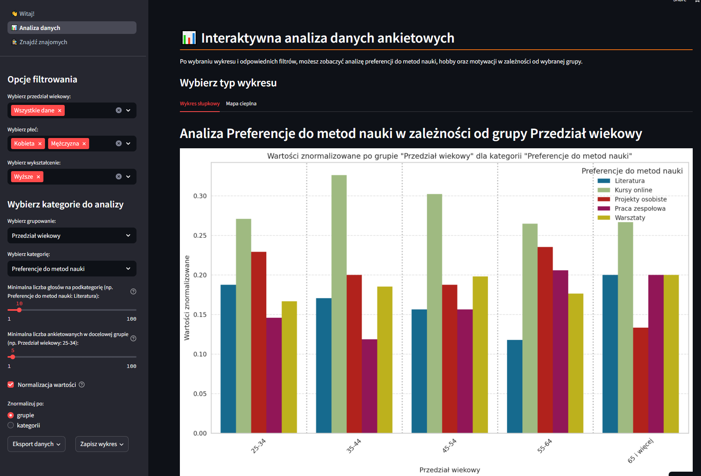
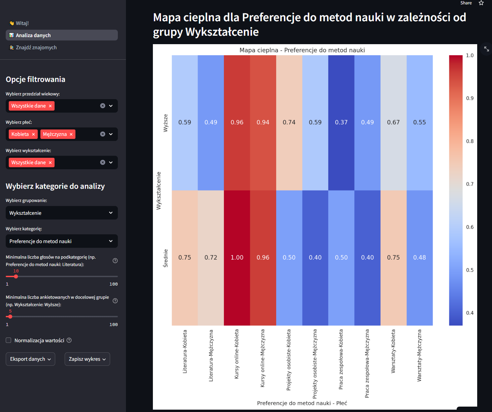
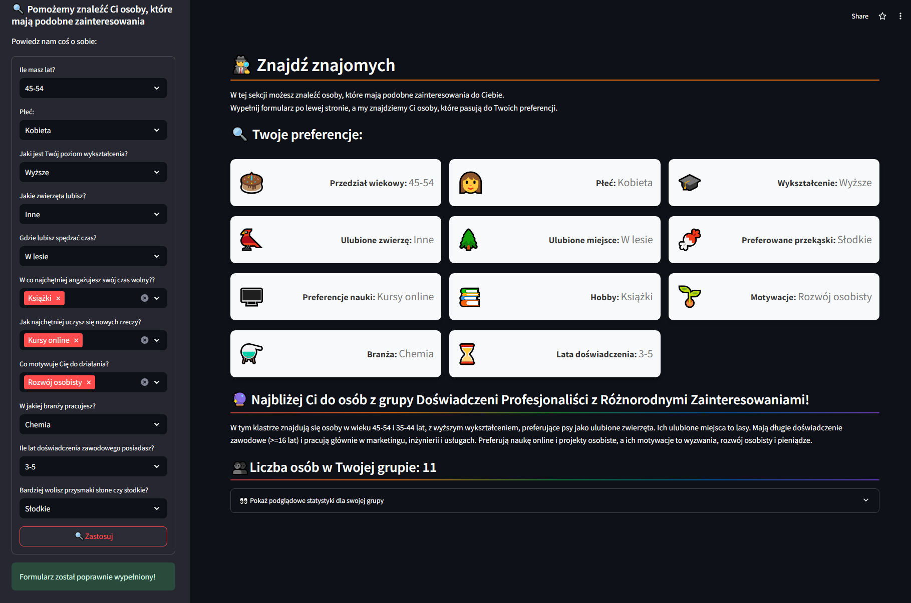
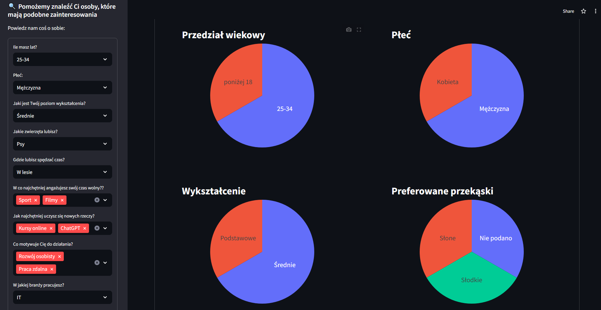

# Analizuj, Łącz, Odkrywaj!

**Autor**: [Maciej Lubaszka](/od-zera-do-ai-portfolio/uczestnicy/maciej_lubaszka)

Przedstawiamy aplikację do analizy uczestników kursu – prawdziwy hit w świecie eksploracji danych ankietowych! Interaktywna i dynamiczna - aplikacja pozwala użytkownikom w mgnieniu oka zanurzyć się w analizie preferencji i zainteresowań kursantów.

Dzięki inteligentnej segmentacji według wieku, płci, wykształcenia czy ulubionych metod nauki, odkrywamy zupełnie nowe zależności między uczestnikami. Zakładka „Znajdź znajomych” to prawdziwa rewolucja – każdy użytkownik znajdzie tutaj bratnią duszę o podobnych pasjach i hobby!

Aplikacja błyskawicznie dostosowuje się do potrzeb użytkownika, oferując zaawansowane filtry i intuicyjne ustawienia, które umożliwiają analizę od hobby po motywacje. Dynamiczne wykresy, takie jak efektowne diagramy kołowe i słupkowe, prezentują dane w czytelny i ekscytujący sposób.

Aplikacja nie tylko wygląda nowocześnie, ale też jest bajecznie prosta w obsłudze – intuicyjne suwaki i wybory wielokrotne sprawiają, że filtrowanie danych to czysta przyjemność. To idealne narzędzie do odkrywania preferencji kursantów z dużą dawką frajdy przy analizie!

Poniżej znajdziesz link do aplikacji, a także kilka zrzutów ekranu, które prezentują jej funkcjonalności.

Link do aplikacji: [Analizuj, Łącz, Odkrywaj!](https://survey-welcomes-analysis.streamlit.app/)

