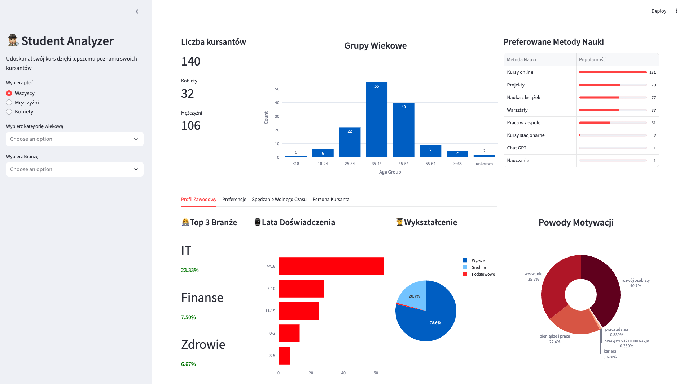
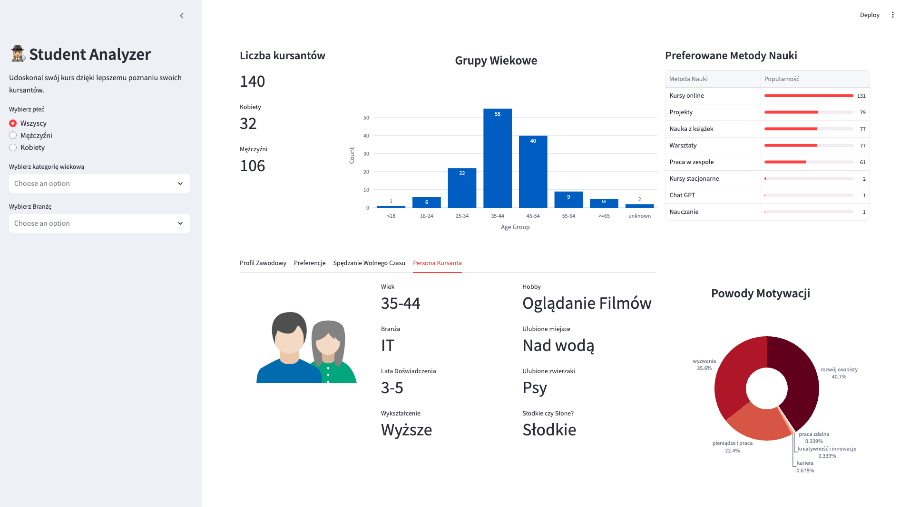

# Kolor i prostota

**Autor**: [Karol Zdańkowski](/od-zera-do-ai-portfolio/uczestnicy/karol_zdankowski)

Przedstawiamy aplikację do analizy danych z ankiety powitalnej, mistrzowsko zaprojektowaną przez Karola. To narzędzie, które łączy w sobie elegancję, prostotę i funkcjonalność, tworząc idealne środowisko do eksploracji danych.

Co wyróżnia tę aplikację? Przede wszystkim starannie dobrana paleta kolorów, która nie tylko cieszy oko, ale również ułatwia zrozumienie prezentowanych informacji. Każdy element został zaprojektowany z myślą o użytkowniku, dzięki czemu wizualizacje są klarowne i nie przytłaczają nadmiarem szczegółów.

Prostota to kluczowa cecha tej aplikacji – Karol zadbał o to, by każdy mógł z niej skorzystać bez potrzeby wcześniejszego przygotowania. Wystarczy kilka kliknięć, by zanurzyć się w świecie danych i odkryć interesujące wnioski. To narzędzie jest dowodem na to, że analiza danych może być zarówno potężna, jak i przystępna.

Poniżej prezentujemy kilka zrzutów ekranu z aplikacji Karola.

