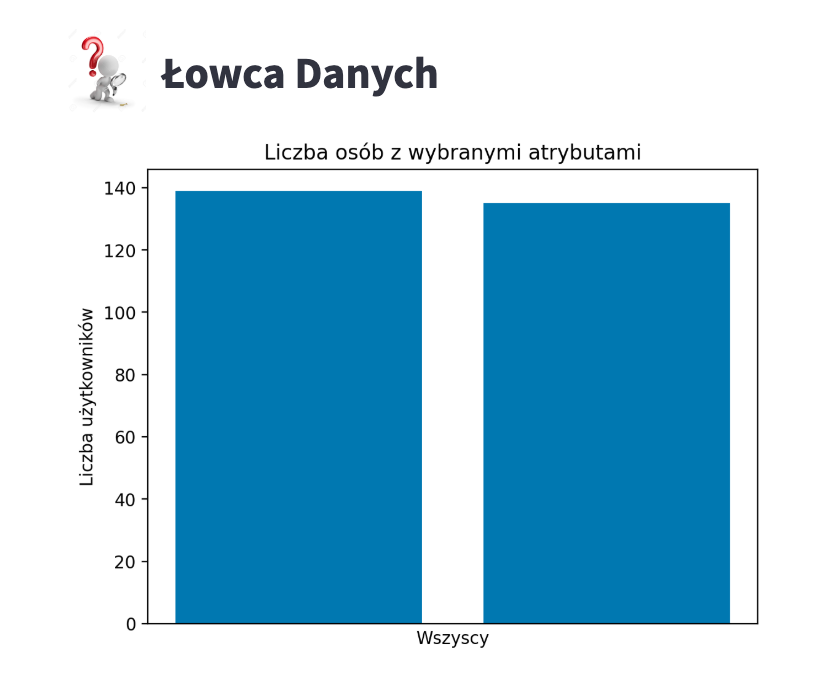
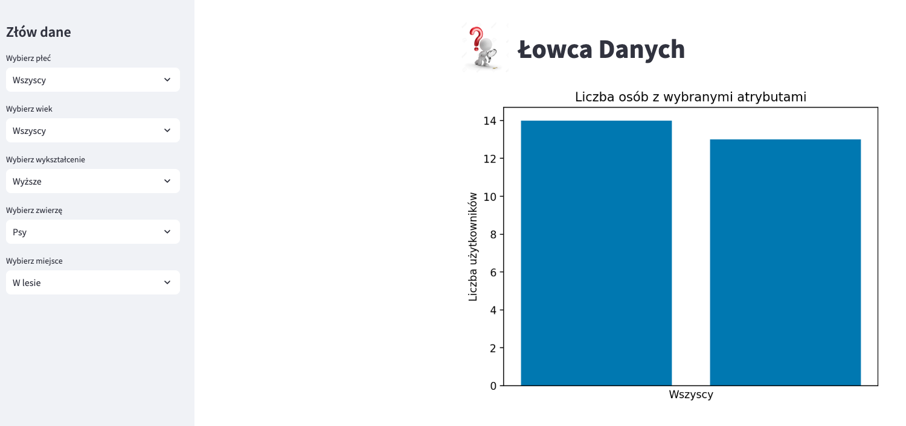

# Polowanie na dane - prosty i efektywny sposób eksploracji danych

**Autor**: [Piotr](/od-zera-do-ai-portfolio/uczestnicy/piotr)

Przedstawiamy prostą, ale niezwykle efektywną aplikację do eksploracji danych z ankiety powitalnej. Piotr, autor tego narzędzia, zastosował nietypowe podejście do prezentacji wyników, które wyróżnia się swoją prostotą. Użytkownik, bawiąc się różnymi filtrami, może odkrywać liczbę osób spełniających określone kryteria. Aby poznać inne dane, wystarczy zmienić kryteria, co sprawia, że użytkownik wciela się w rolę prawdziwego łowcy danych.

