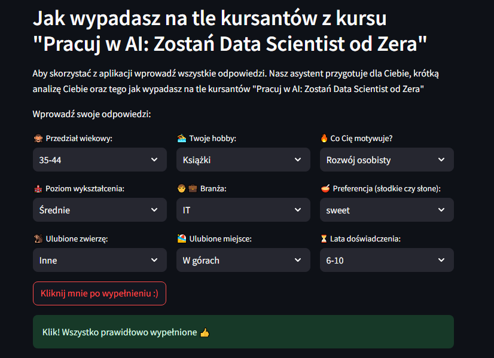
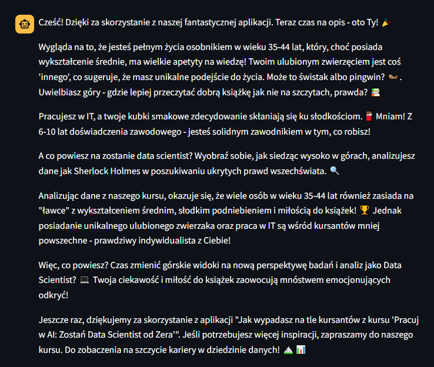
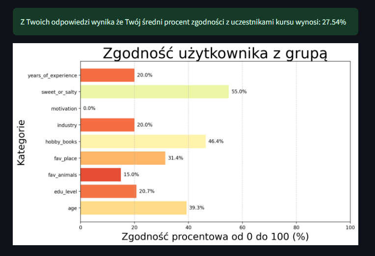

# Aplikacja AI Group Fit - Dopasowanie do Grupy!

**Autor**: [Jakub Kłosiński](/od-zera-do-ai-portfolio/uczestnicy/jakub_klosinski)

Ta aplikacja to interaktywne narzędzie, które pozwala użytkownikowi odkryć, jak wypada na tle innych uczestników kursu "Pracuj w AI: Zostań Data Scientist od Zera". Po wypełnieniu krótkiego formularza z danymi demograficznymi, preferencjami i zainteresowaniami, użytkownik otrzymuje analizę swojej zgodności z grupą – zarówno w postaci procentowego dopasowania, jak i czytelnego wykresu.

Dzięki aplikacji można dowiedzieć się, czy Twoje wybory w kwestii motywacji, hobby czy doświadczenia zawodowego są typowe dla przyszłych Data Scientistów, czy może wyróżniasz się na tle grupy jako prawdziwy indywidualista. Atrakcyjny interfejs i humorystyczne podsumowanie wyników sprawiają, że korzystanie z aplikacji to świetna zabawa połączona z inspiracją do dalszej nauki i rozwoju w świecie AI!

Poniżej znajdziesz kilka zrzutów ekranu, które prezentują jej funkcjonalności.

