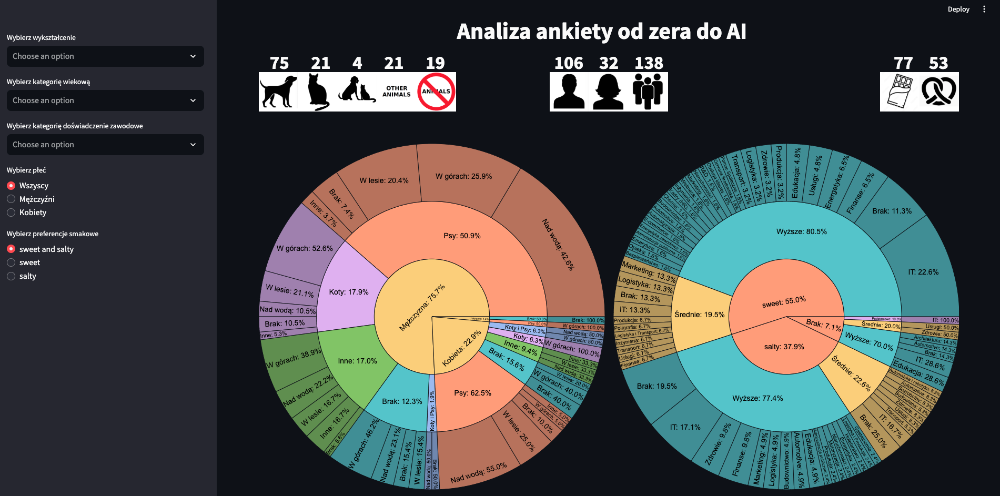
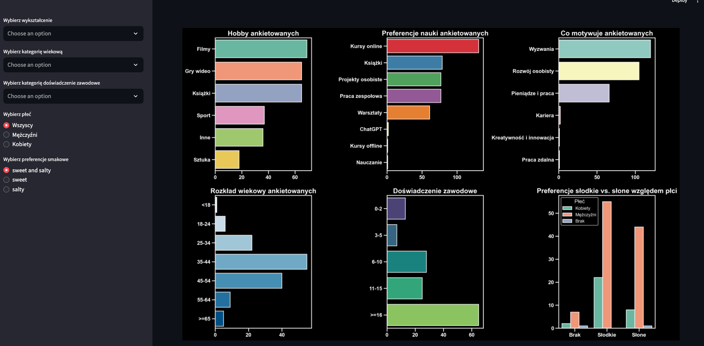
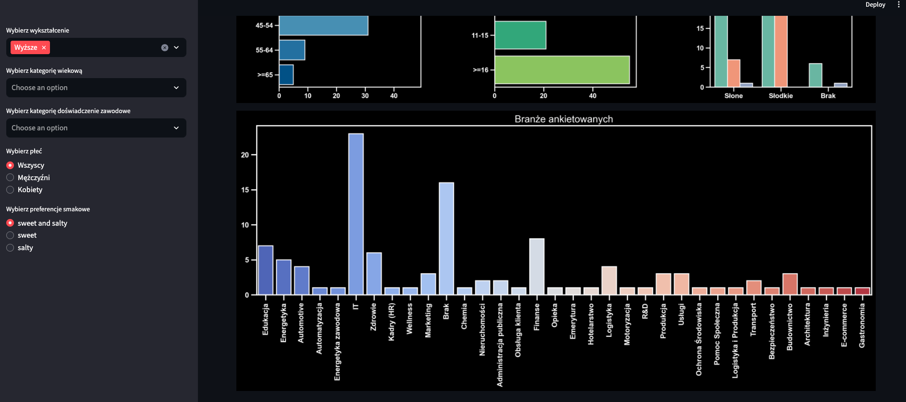

# Aplikacja do przeglądu wyników ankiet - niezwykłe wizualizacje

**Autor**: [Mariusz](/od-zera-do-ai-portfolio/uczestnicy/mariusz)

Wizualizacje to absolutny fundament analizy danych. Dzięki nim możemy nie tylko lepiej zrozumieć wyniki ankiet, ale także podejmować bardziej świadome i trafne decyzje. Te wizualizacje pokazują, jak kluczowe jest odpowiednie przedstawienie danych - nie tylko w sposób przejrzysty, ale także angażujący i estetyczny. Aplikacje prezentujące dane powinny być interaktywne, przyciągające wzrok i intuicyjne w obsłudze, aby użytkownicy mogli czerpać maksimum korzyści z analizy. Zanurz się w fascynujący świat wizualizacji danych i odkryj, jak mogą one zmienić Twoje podejście do analizy wyników ankiet!

