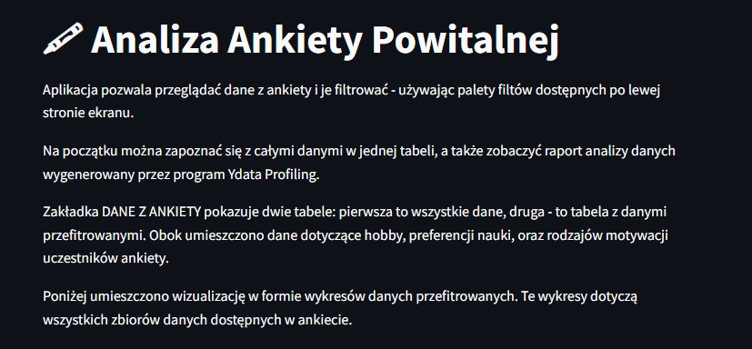
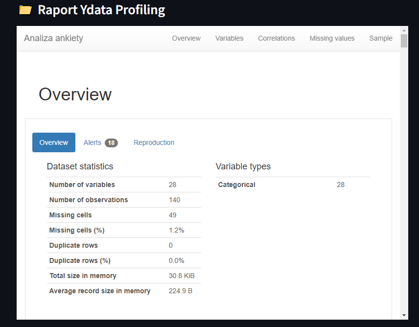
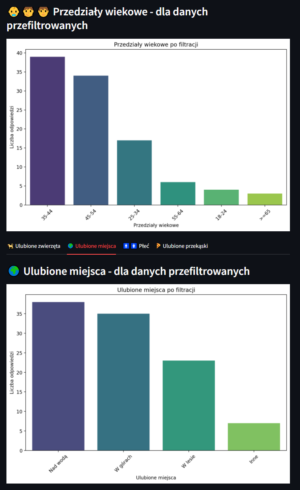
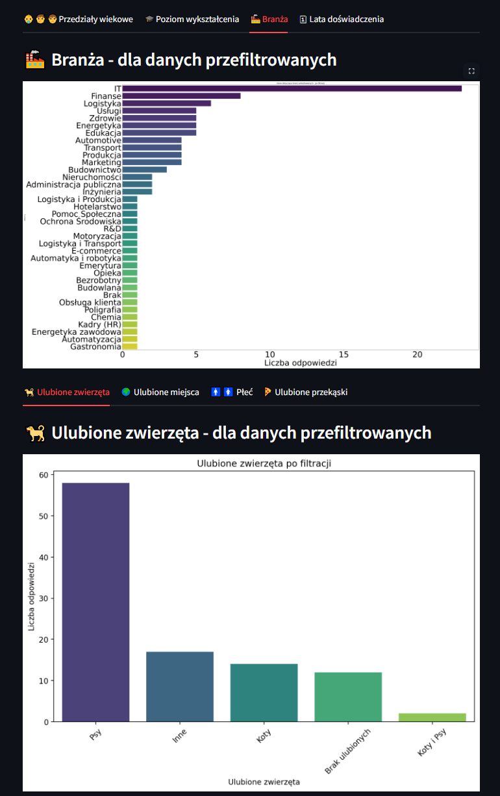

# Interaktywna aplikacja do analizy wyników ankiety powitalnej

**Autor**: [Grzegorz Jaworucki](/od-zera-do-ai-portfolio/uczestnicy/grzegorz_jaworucki)

Ta aplikacja to prawdziwy hit dla każdego, kto chce szybko i intuicyjnie analizować dane z ankiety powitalnej! Dzięki zaawansowanym filtrom możesz bez wysiłku odkrywać, kto woli góry, a kto lasy, czy bardziej popularne są koty, czy psy. W zakładce "Dane z ankiety" znajdziesz szczegółowe tabele i profesjonalny raport Ydata Profiling, który rzuca światło na najważniejsze statystyki. Wisienką na torcie są wizualizacje – kolorowe wykresy, które nie tylko robią wrażenie, ale też pomagają zrozumieć dane w mgnieniu oka. To narzędzie to świetny sposób, by w prosty i przyjemny sposób wyciągać ciekawe wnioski z danych! 🚀

Poniżej znajdziesz kilka zrzutów ekranu, które prezentują jej funkcjonalności.

