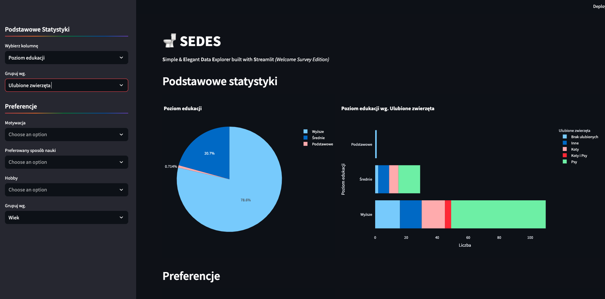
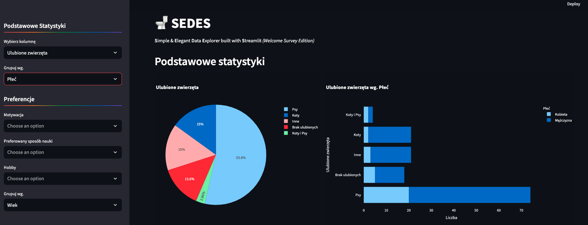

# Sedes

**Autor**: [Michał Pecyna](/od-zera-do-ai-portfolio/uczestnicy/michal_pecyna)

Z dumą prezentujemy elegancko zaprojektowaną aplikację do przeglądu wyników ankiety powitalnej. Dzięki przejrzystym i estetycznym wizualizacjom oraz intuicyjnemu interfejsowi użytkownika, każdy może z łatwością zrozumieć i analizować dane. Nazwa i stylistyka aplikacji są utrzymane w lekkim, przyjaznym tonie, co dodatkowo uprzyjemnia korzystanie z narzędzia.

